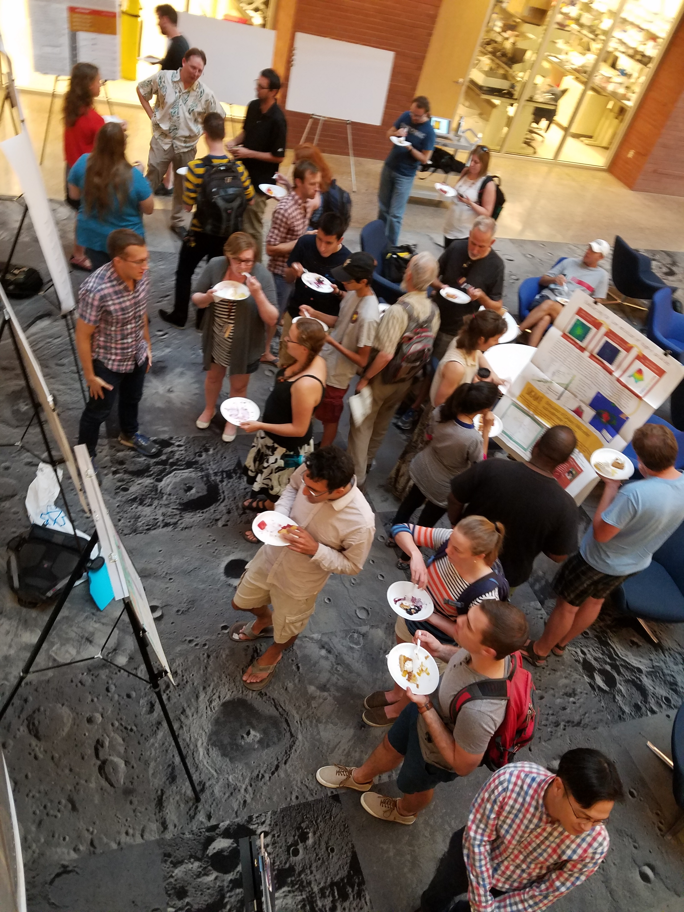
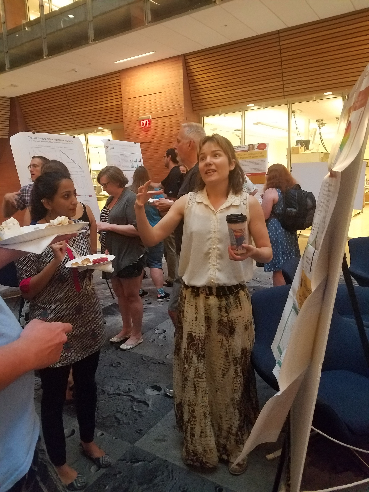

## Organizer of Python meetings
At ASU, I organized group meetings for scientists using python in their research at ASU. 
Meetings are every second week and we have a github repository to share knowledge and ask questions. 
We decided a topic for each meeting based on where people are having most struggles! 
I passed the organization of these meetings onto Joe Chen at the Physics Department of ASU, 
so if you would like to join the mailing list or be part of the github repository, 
please send him an email. 
Typically, the meetings start with a short presentation by someone who has experience in 
the topic followed by discussion and hands-on learning. 
The group includes undergrads to professors, and is not restricted to SESE members. 
so if you would like to join the mailing list or be part of the github repository, 
just shoot Joe (or me) an email. 
Check out our group page by clicking below:

<a class="radius button small" href="https://prickly-pythons.github.io/">Go to the Prickly Pythons website›</a>

 
 

## Co-organizer of P^3 = Postdoc Posters and Pie Research Forum at SESE in 2016 and 2017, ASU

I helped organizing annual poster conferences at SESE, ASU, for postdocs and others to see 
some of the amazing science that goes on at SESE! Below is a photo taken from a balcony above the scene:

  </a>
  </a>

 

## Talks, meetings and interviews

Below are previous talks that I gave, and meetings I attended or plan to attend. 
If you want the keynote/powerpoint version of any presentation (given in PDF here) please contact me!

___

## 2018

<b style="color: #006699">04-20-18: SESE Cosmology seminar</b> 
I gave a talk at my department, summarizing my recent work with <a href="https://kpolsen.github.io/SIGAME_dev/">SÍGAME</a> and outlining on-going and future 
research projects. Title: 'Making Sense of FIR Line Emission with Synthetic Observations'. 
<a href="presentations/SESE_seminar_short_version.pdf">View and download a PDF version of the talk here</a>

 
 

<b style="color: #006699">03-14-18 to 03-16-18: Walking the Line 2018</b> 
I organized a workshop at Arizona State University, centered on the challenge of modeling line emission in galaxies near and far. This workshop brought together experts as well as students in the field for 3 days of talks and focused discussion sessions.  
 <a href="https://walk2018.weebly.com/">See website with full program and list of participants.</a> 
 <a href="https://zenodo.org/communities/walk2018/">See this community site at zenodo.org for slides and recordings of talks.</a>

 
 

<b style="color: #006699">01-13-18: Conferences for Undergraduate Women in Physics (CUWiP)</b> 
I participated as invited speaker to the breakout session about "Hot Topics in Physics".  
 <a href="">http://www.aps.org/programs/women/workshops/cuwip.cfmSee the program here.</a> and download my <a href="presentations/CUWiP/hot_topic_2018.pdf">presentation slides in PDF format here</a>.

 
 

___

## 2017

<b style="color: #006699">08-15-17: Webinar in the FIR SIG group</b> 
I gave a webinar to the Far-Infrared Science Interest Group (FIR SIG) and you can 
 <a href="https://www.cfa.harvard.edu/~mmacgreg/FIR_SIG/seminars.html">watch it here</a>.

 
 

<b style="color: #006699">06-29-17: Colloquium at IRyA, UNAM, Morelia, Mexico</b> 
While visiting the "Instituto de Radioastronomía y Astrofísica", I gave a 50min talk on results with SÍGAME modeling [CII] emission at redshift 6, now 
forming a paper submitted to ApJ.
<a href="presentations/[CII]_at_z_6_UNAM.pdf">View and download a PDF version of the talk here</a>

 
 

<b style="color: #006699">04-28-17: Cosmology Seminar (aka Pizza Talk), Tempe, Arizona</b> 
I gave a 45min talk at my institute (SESE, ASU) 
on results with SÍGAME for modeling [CII] emission at redshift 6, now 
forming a paper close to submission.
<a href="presentations/[CII]_at_z_6_SESE.pdf">View and download a PDF version of the talk here</a>

 
 

<b style="color: #006699">01-14-17 to 01-18-17: Dawn of Galaxies 2017 meeting, Obergurgl, Austria</b> 
I'm attending a meeting on galaxy evolution during the Epoch of Reionization.
<a href="http://dawnofgalaxies2017.at/index.php/program">See a program here</a>

 
 
___

## 2016

<b style="color: #006699">11-14-16 to 11-18-16: Visitor at NMSU, Las Cruces, NM</b> 
I came to collaborate with professor Kristian Finlator primarily, and gave a colloquium on Friday Nov 18 
on early results with SÍGAME for modeling [CII] emission at redshift 6.
<a href="presentations/[CII]_at_z_6_NMSU.pdf">View and download a PDF version of the talk here</a>

 
 
 

<b style="color: #006699">06-12-16: American Astronomical Society 228th meeting, San Diego, CA</b> 
Attending with poster.

 
 
 

<b style="color: #006699">05-10-16: Participating in SOFIA workshop, Tucson, AZ</b> 
A hands-on workshop on what you can do with (and how to write proposals for) 
<a href="http://www.sofia.usra.edu/"The Stratospheric Observatory for Infrared Astronomy (SOFIA)</a>
which is an amazing airborne observatory. 

 
 

<b style="color: #006699">04-22-16: Gave an interview for ASU connections</b> 
On my work and daily life as a postdoc at SESE! I had a great time talking to the host, 
Kevin Conklin and you can listen to the podcast here: 

<audio controls>
  <!-- <source src="horse.ogg" type="audio/ogg"> -->
  <source src="presentations/Olsen_Conklin_2016.mp3" type="audio/mpeg">
  Your browser does not support the audio element.
</audio>
<!-- <a href="presentations/Olsen_Conklin_2016.mp3">Download mp3 file</a>. -->

 
 

<b style="color: #006699">04-04-16: Molecular GAs in Galactic Environments, Charlottesville, VA</b> 
Attending and gave a talk on 06/04 - see program 
<a href="https://science.nrao.edu/science/meetings/2016/molecular-gas-in-galactic-environments/program-schedule">here</a>. 
And download the keynote presentation of my talk from the Open Science Framework: 
<a href="https://www.sofia.usra.edu/">https://osf.io/9mzkd/</a>

 
 
___

## 2015

<b style="color: #006699">12-02-15: Talk at NRAO, Socorro, NM</b> 
Simulating [CII] emission: Results for z=2 main sequence galaxies 
<a href="presentations/2015-12-02.pdf">View and download a PDF version of the talk here</a>

 
 

<b style="color: #006699">11-10-15: Practice Talk Session at SESE, ASU in Tempe, AZ</b> 
First session: Key aspects of a good talk (prepared and presented in collaboration with <a href="http://sese.asu.edu/people/julia-cartwright">Julia Cartwright</a> from SESE.) 
<a href="presentations/2015-11-10.pdf">View and download a PDF version of the talk here</a>

 
 

<b style="color: #006699">09-18-15: Cosmology Seminar at SESE, ASU in Tempe, AZ</b> 
ISM: Modeling and observing 
<a href="presentations/2015-09-18.pdf">View and download a PDF version of the talk here</a>

 
 

<b style="color: #006699">11-07-15: KISS meeting, Pasadena, CA</b> 
Bridging the Gap: Observations and Theory of Star Formation Meet on Large and Small Scales: A one week conference/workshop at the Keck Institute
of Space Studies (KISS) to establish the goals that will enable progress in this field of astronomy.   
<a href="http://kiss.caltech.edu/new_website/programs/SF-FullDraft.v5c.pdf">Read the final report that I contributed to here.</a>
