Dates: 2017-09-21 to 2017-09-24

Wildfires are common in the Southwest, and when a 
hillside is left bare from the scorching flames, 
the first plants to repossess the land are typically invasive, 
non-native plants from for example Europe. 
This trip, planned by [Sky Island Alliance](https://www.skyislandalliance.org/), was headed for 
a recently burned hillside right next to the Gila Cliff Dwellings 
in Western New Mexico. 
We set off from Tucson on Thursday at 10AM in the "blue whale" (an old, but steady van) to meet 
the rest of the crew at the Upper Scorpion Campground, very close 
to the National Monument. The afternoon was spent on setting up tents and 
learning all the new faces! 
My REI tent still feels like new and I've figured out the exact amount of 
duvets and blankets to not be cold at night:

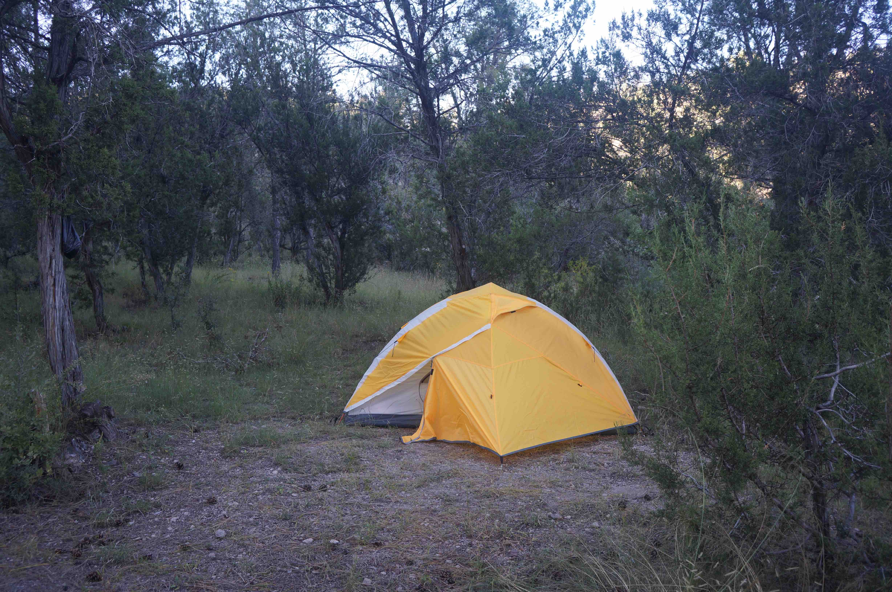

 

We were a large group of people coming from different organizations 
(National Park Service, Arizona Native Plant Society, American Conservation Experience in addition to SIA), 
but these were our guides and coordinators:

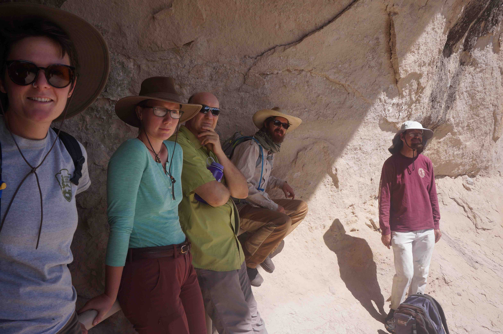
 

From left to right: Genine from NPS, Madeline from SIA (and her dad), 
Bryon from SIA and Marcus from AZNPS. 

On Friday we had breakfast with the rising sun...

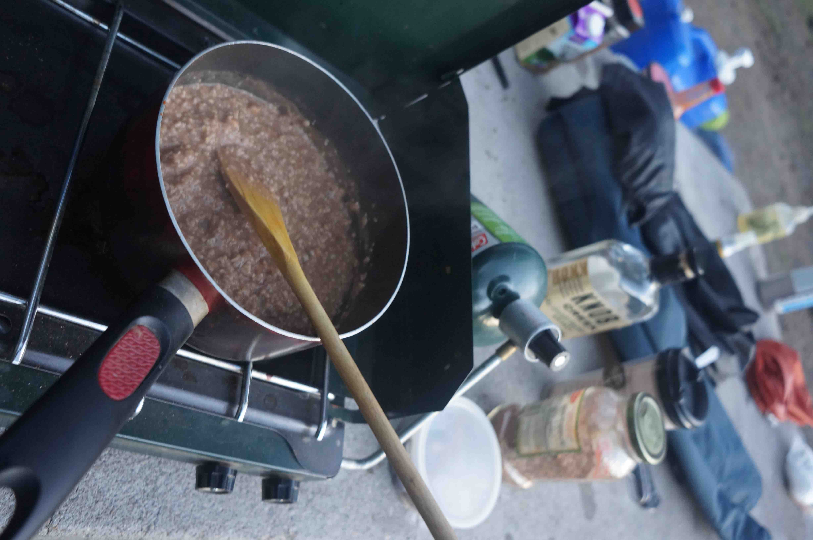
 

At 9AM we got to work, planting native seedlings together with 
drywater and a flag to keep track of the species (the position of each plant 
was actually marked by GPS!):

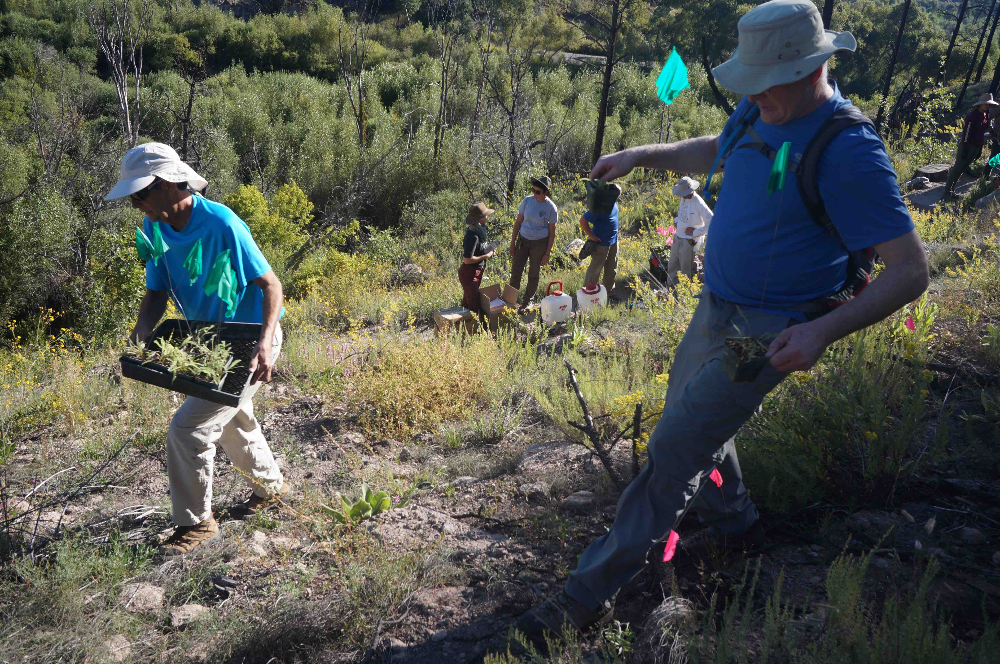
 

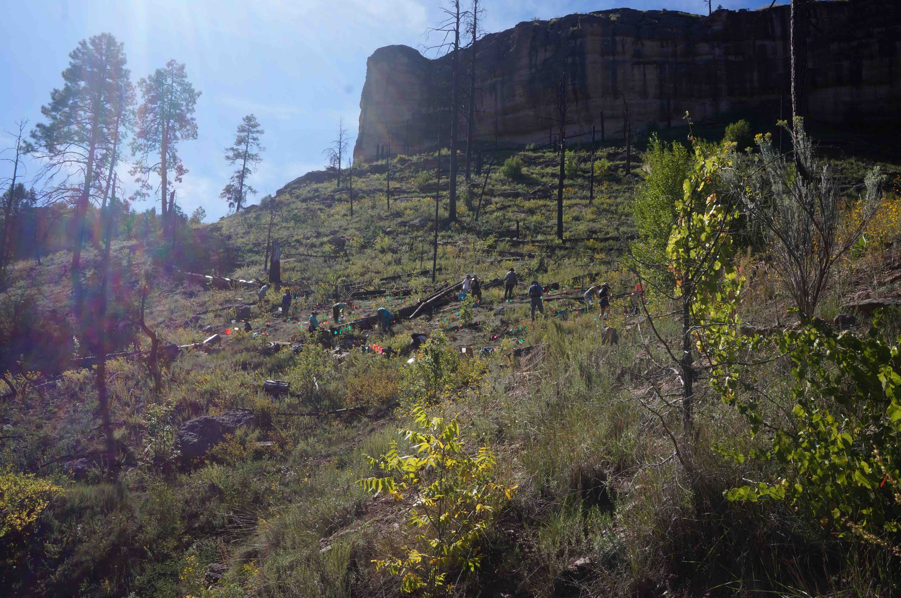

Both Friday and Saturday night we went to a natural hotsprings 
to rinse off the dust and heat the bones:

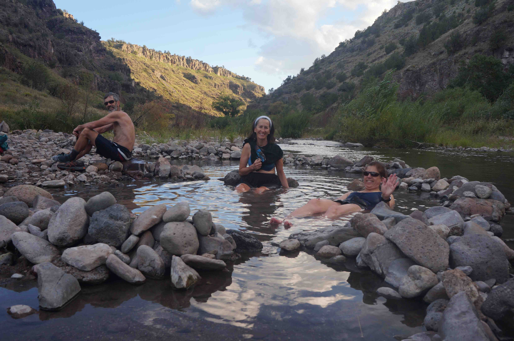
 

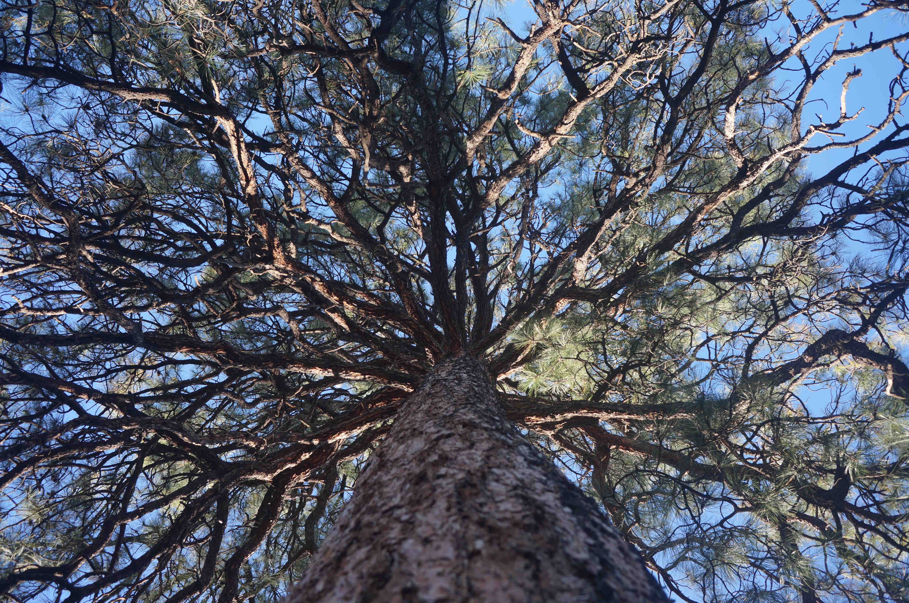

On Saturday it actually started raining and we had to abandon the seed 
collection that Marcus had initiated. 
Traveling with people that are very experienced in camping is so pleasant though - of course some 
people had brought covers in case of rain.

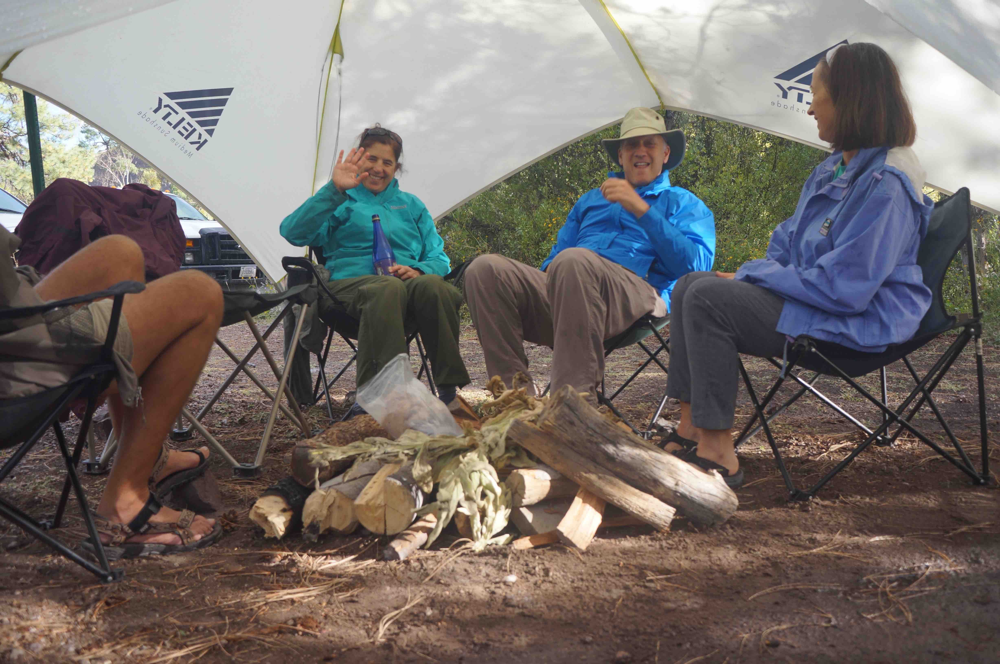

On Saturday we had a guided tour to the Gila Cliff dwellings, 
learning about the Mongollon people that used to live here 
from 1275 to the early 14th century.

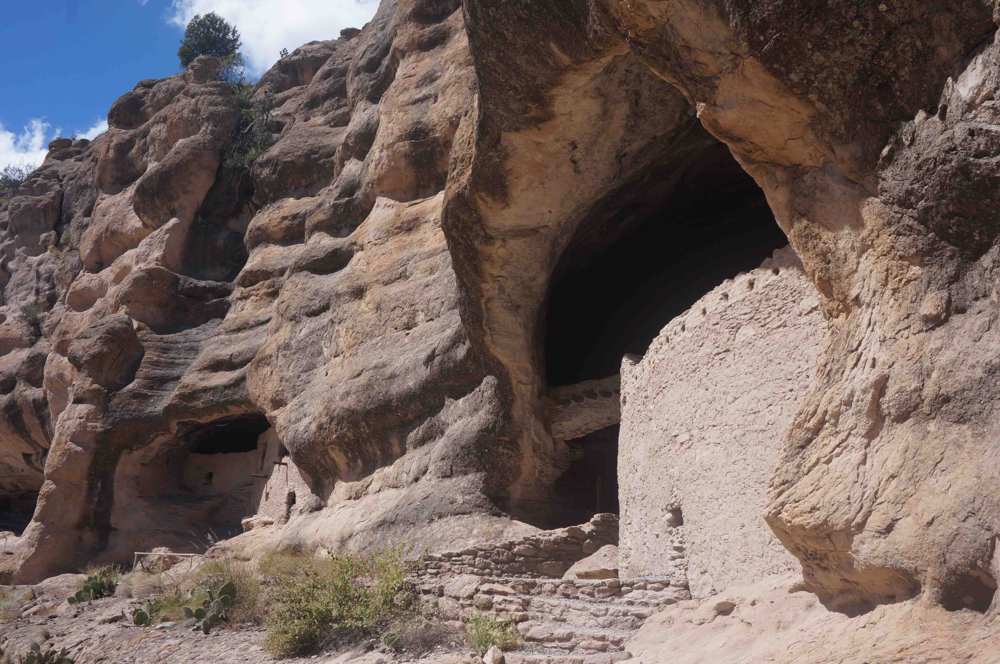
 

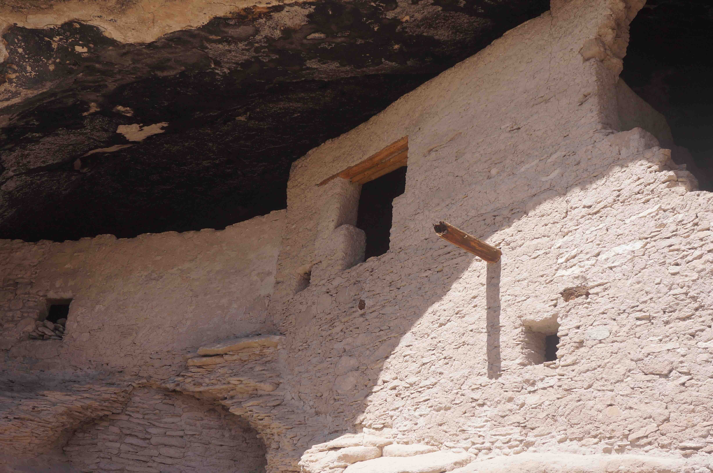
 

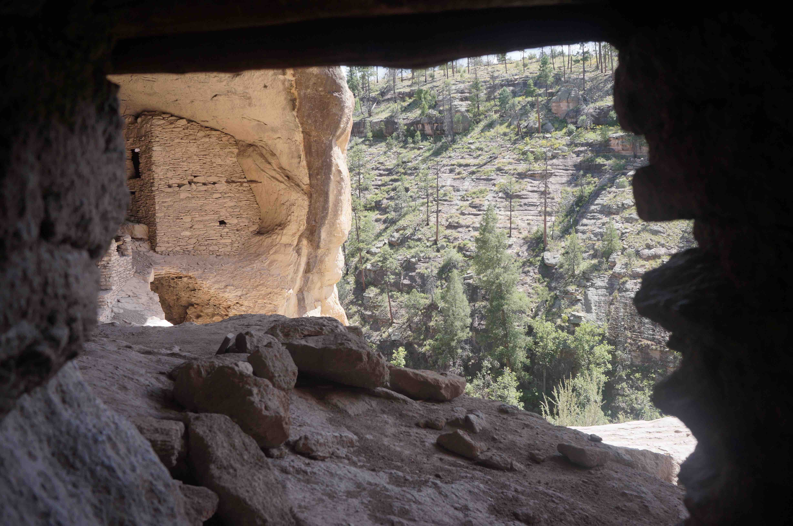

The T-shaped door above is apparently a trademark of the 
Anasazi (or pueblo) people, showing that the different tribes communicated and 
mixed. This hillside on the other side of the cayon looked particularly dreamy and 
full of legends to me:

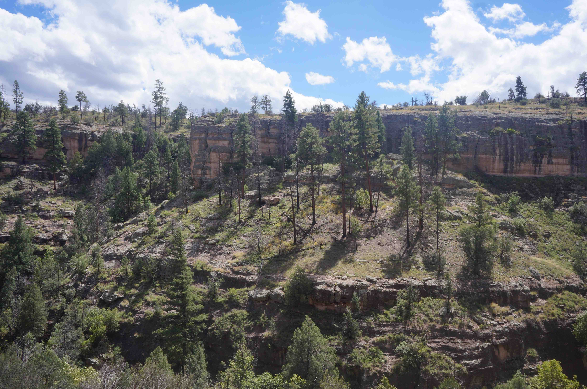

On Sunday morning, I washed my hair in the river before we got to work pulling 
up the invasive mullein plant.

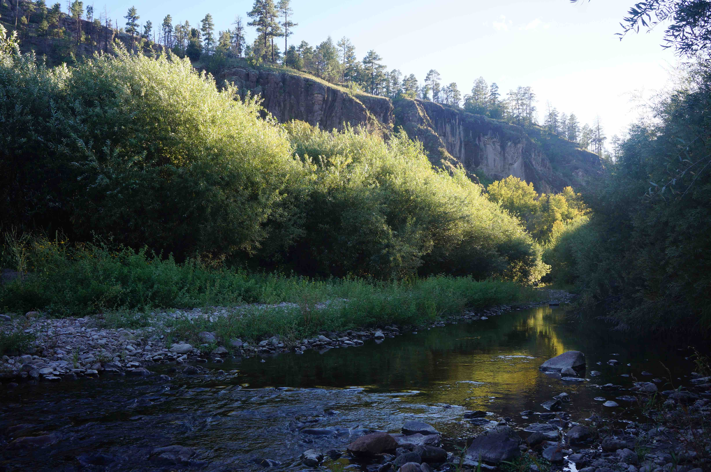

And that was it! After lunch, we headed back to Tucson through the [Texas Canyon](http://www.desertrambler.com/texas-canyon.html) - 
that weird area of boulders(1) thrown around at random.

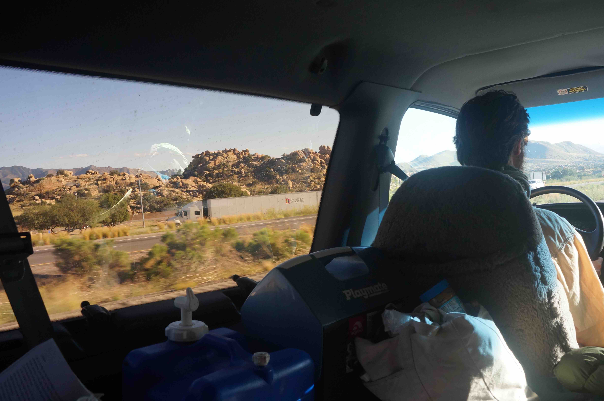

(1) boulders that look kind of like turds if you ask Barbara Kingsolver.