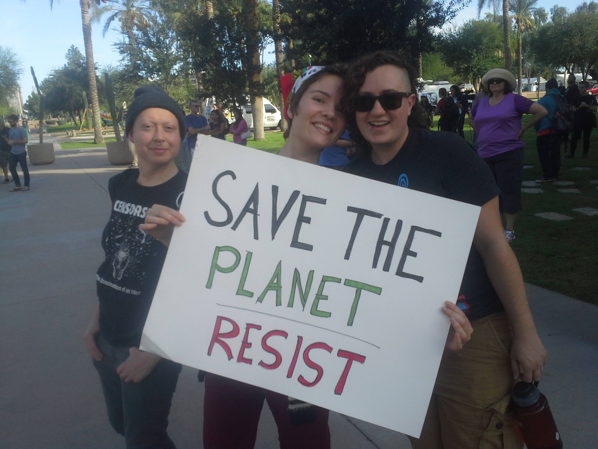
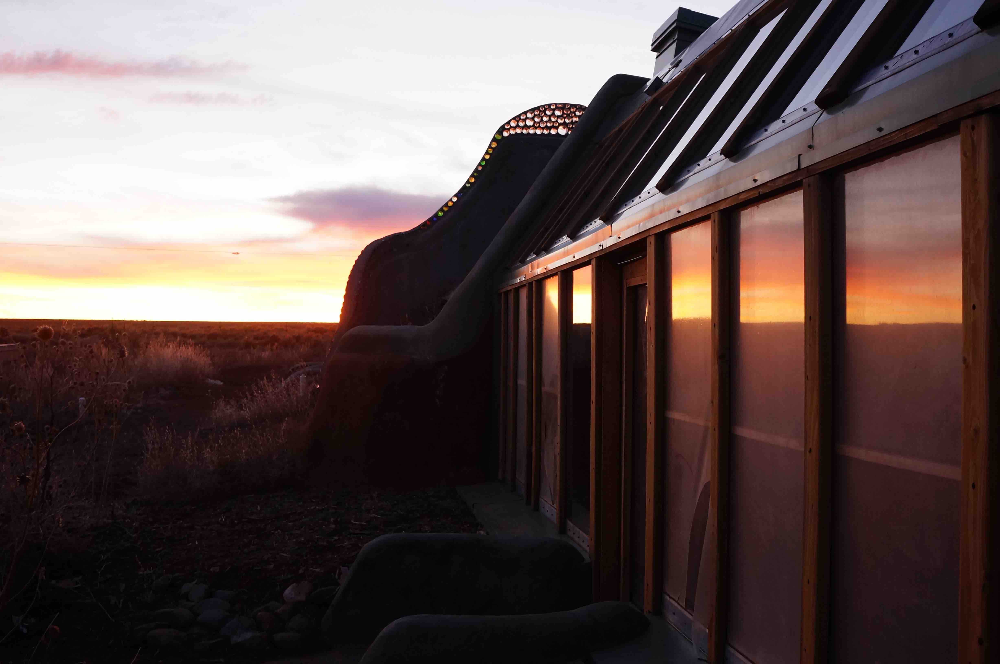
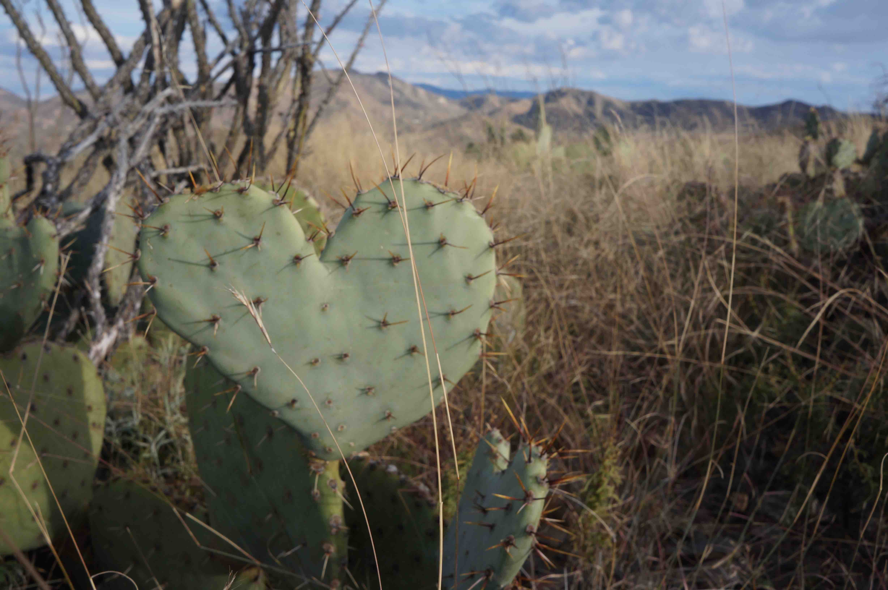

<b style="color: #006699">Planting pollinators with Sky Island Alliance </b> 

Dates: 2017-09-21 to 2017-09-24

Planting polinators close to the Gila Cliff Dwellings in New Mexico. 

(click the image to keep reading...)

<!-- <a class="radius button small" href="{{ site.url }}/research/astro/">Read about my projects in astronomy›</a> -->

<b style="color: #006699">Post-election demos </b> 

Dates: 2016-11-12

Demonstrating in central Phoenix. 

(click the image to keep reading...)

---

<b style="color: #006699">Building Earthships in Taos</b> 

Dates: 2016-02-08 to 2016-02-27

A 3-week internship, meeting lovely people and living out a passion! 

(click the image to keep reading...)

---

<b style="color: #006699">Assessing springs with Sky Island Alliance</b> 

Dates: 2015-11-14

A day in the southwestern wilderness. 

(click the image to keep reading...)

---

<b style="color: #006699">Salvaterra Ecofestival</b> 

Dates: 2015-06-30 to 2015-07-06

---

<b style="color: #006699">Førde Traditional and World Music Festival</b> 

Dates: 2013-07-03 to 2013-07-07

