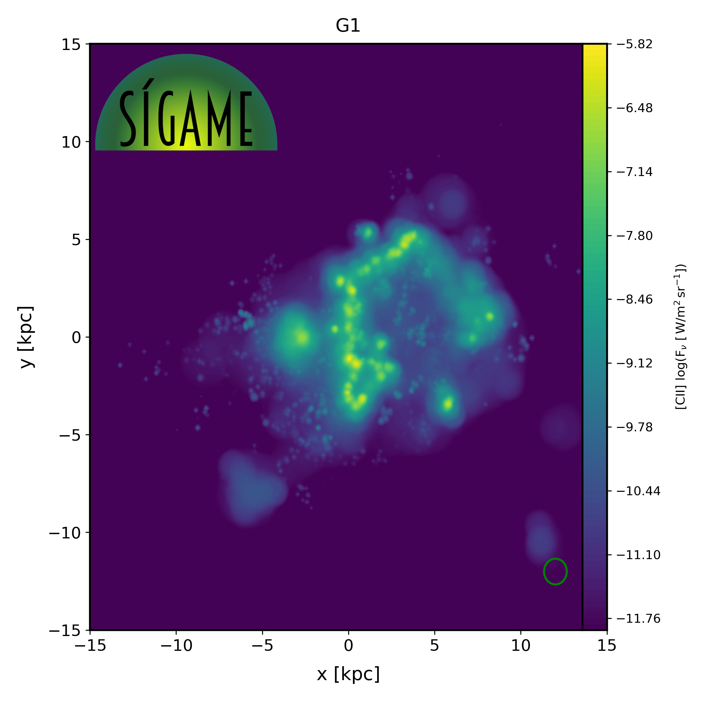
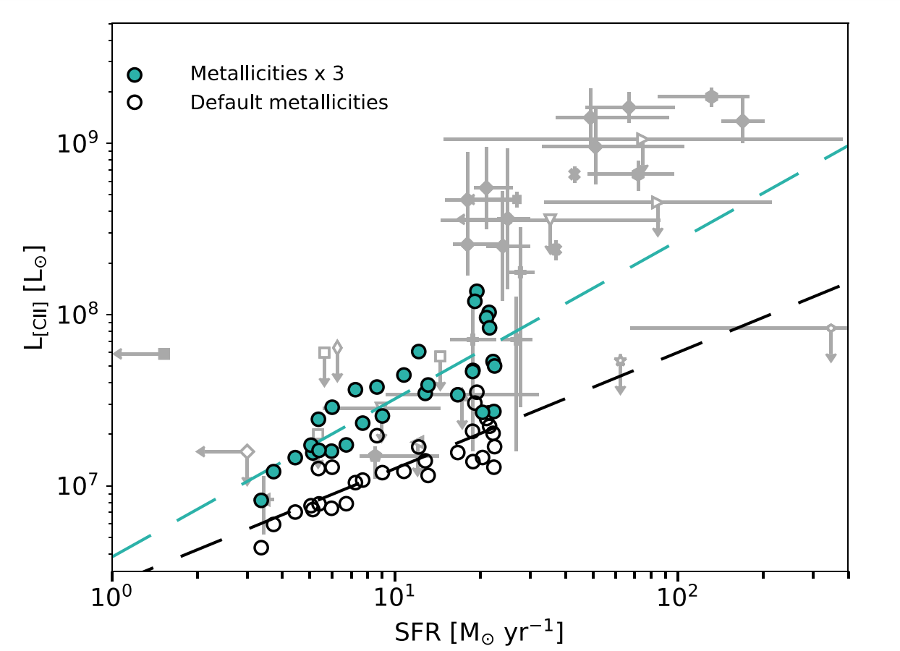
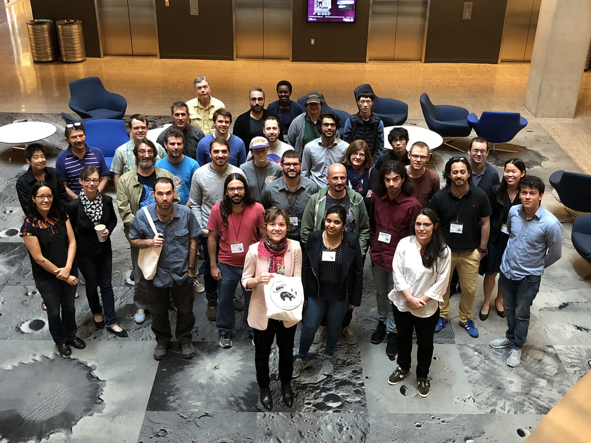

Last edited: Jan 2 2020 

<h2 style="color: #006699">Research interests in astronomy</h2>
Keywords: <i>Evolution of galaxies; Epoch of re-ionization; Interstellar Medium, 
Emission lines in radio; Radio interferometry; Galaxy simulations</i>  

How did galaxies such as the Milky Way form? Astronomers can observe glimpses of the Universe at different timestamps since the Big Bang, but putting those snapshots together to understand galaxy evolution is no easy task! What we *do* know, is that the interstellar medium (or ISM) plays a crucial role in determining when and how many stars are formed in a galaxy.

I study galaxy evolution with a focus on modeling the emission from the ISM to improve the way we interpret observations of the ISM in galaxies at all epochs of the Universe. 
By observing a portion of the ISM in different wavelengths, different images emerge, 
and astronomers can extract important information from each ISM phase, from molecular to ionized:  

**Figure:** The interstellar medium (ISM).

The best technique for observing the ISM is to look for emission lines in the infrared (left bottom panel above), 
where rotational lines of molecules and fine structure lines of atoms and ions are easily excited at 
typical ISM temperatures and densities.   

<h2 style="color: #006699">SÍGAME</h2>

In order to study the ISM, I have developed a software tool called SÍGAME which is a module written in Python and designed to model nebular line emission in the 
far-infrared from galaxies and make predictions for future observations. 
Here's an example of a flux map in [CII] fine structure line at 158 micron of a model galaxy:

**Figure:** Synthetic emission map of a model galaxy.

I started developing SÍGAME during my PhD at the Dark Cosmology Centre, a Center of Excellence in Denmark. 
Over the years, it has grown into a mature software tool written in python and applicable to many cases of 
galaxy studies. 
I have led three first-author publications on SÍGAME and enjoyed working with team members from around the world, 
and the software tool is now available for download via GitHub. Below is a link to learn more about SÍGAME, followed by descriptions of my main research projects. See the [Contact](http://kpolsen.github.io/Contact/) tab for my contact info in case you have any questions about SÍGAME and its use.

<a class="radius button small" href="{{ site.url }}/SIGAME_v2/index.html">Learn more about and download SÍGAME here›</a>

<h2 style="color: #006699">ISM in the Early Universe</h2>
During my time as post-doctoral researcher at the [School of Earth and Space Exploration](https://sese.asu.edu/) (SESE)
at Arizona State University (ASU), I studied galaxy evolution during the early days of the Universe, at a redshift of 6 which means about 13 billion years ago (!). 

By applying SÍGAME to cosmological hydrodynamic simulations of galaxies at redshift 6, my team and I made predictions for the relation between the star formation rate (SFR) of galaxies and different line luminosities in the far-infrared. We also described the origin of the [CII] emission, as coming mostly from molecular clouds, and secondly from diffuse ionized gas. Below is a plot showing the importance of gas metallicity on the [CII]-SFR relation with observations at redshifts > 5 in grey for comparison [5,6]:

**Figure:** The [CII]-SFR relation for a sample of simulated galaxies at redshift around 6 (open circles), with symbols in cyan showing the effect of boosting metallicities by a factor of 3 in all galaxies.

At ASU, my mentors were [Sangeeta Malhotra](http://malhotra.asu.edu/Welcome.html) and [Rogier Windhorst](https://en.wikipedia.org/wiki/Rogier_Windhorst). 

<h2 style="color: #006699">ISM in during the Cosmic Peak of Star Formation</h2>

Observations show that the cosmic density of star formation rate peaked at a redshift around 2, which is about 11.5 billion years ago. Understanding what changed in galaxy evolution around this time, is a pressing issue for astronomers. I applied SÍGAME to simulated galaxies during this epoch, to improve on the interpretations of [CII] fine-structure and CO rotational lines [2,4].

<h2 style="color: #006699">Organizing a conference on simulations of line emission</h2>

In March 2018 I organized and lead a 3-day workshop calleld 'Walking the Line' on simulating line emission from galaxies. 
It attracted around 30 researches of all ages from around the world with three prominent invited speakers. 
The program included several break-out sessions and group discussions at the end of each day. 
At the end of the workshop it was decided to write up a proceedings paper on the conclusions 
and scientific questions for the future resulting from our discussions. 
Writing this paper was one of the best experiences in my career within astrophysics so far, because 
I think we were able to highlight the most important challenges faced by astronomers in this field; 
[Read the open source conference paper here](http://www.mdpi.com/2075-4434/6/4/100/htm) [7]. 
I was also lucky to be surrounded by motivated and encouraging participants of the workshop, most of which 
helped in the writing of the paper.

<a class="https://walk2018.weebly.com/">Go to the official website of the conference›</a>

**Figure:** Me and the group of participants at Walking the Line 2018.

<h2 style="color: #006699">X-ray imaging of galaxies</h2>

At the Dark Cosmology Centre, I also worked on a more observational project which quantified the presence 
of active galactic nuclei (AGN) in massive galaxies at redshifts around 2 using [CHANDRA]() archival X-ray data [1]. 
High luminosity AGN are easily detected in X-ray at these redshifts, but to count the low luminosity AGN, 
it is necessary to apply some sort of stacking technique:

As an additional criteria when selecting AGN, the spectral shape of the X-ray emission can be used. 
For quantifying the slope of the X-ray spectra, astronomers typically use the observed "hardness ratio" between 
soft and hard X-ray flux. In the following figure from our paper, X-ray luminosity (on the y-axis) and 
hardness ratio (on the x-axis) are used to identify luminous AGN (filled symbols) and 
potential low-luminosity AGN (open symbols). Stacks of non-detections are shown with squares 
and blue and red colors signify star-forming and "quenched" galaxies, respectively:

**Figure:** Classification scheme to identify AGN.

We find in the paper that the low-luminosity AGN population constitutes a significant part of both the 
star-forming and the "quenched" galaxies at redshifts around 2. 
See my 2013 paper below for more details on the technique and results.

<h2 style="color: #006699">Publications</h2>

[8] 2020: <a href="https://arxiv.org/abs/2004.11912">Predictions of the L[CII] -- SFR and [CII] Luminosity Function at the Epoch of Reionization (submitted to ApJ)</a>

[7] 2018: <a href="http://www.mdpi.com/2075-4434/6/4/100/htm">Challenges and Techniques for Simulating Line Emission (MDPI Galaxies 6(4), 100, 2018)</a>

[6] 2018: <a href="https://ui.adsabs.harvard.edu/abs/2018ApJ...857..148O/abstract">Erratum: "SÍGAME Simulations of the [CII], [OI], and [OIII] Line Emission from Star-forming Galaxies at z ~ 6" (ApJ 857 2, 2018)</a>

[5] 2017: <a href="https://ui.adsabs.harvard.edu/abs/2017ApJ...846..105O/abstract">SÍGAME Simulations of the [CII], [OI], and [OIII] Line Emission from Star-forming Galaxies at z ~ 6 (ApJ 846 2, 2017)</a>

[4] 2016: <a href="https://ui.adsabs.harvard.edu/abs/2016MNRAS.457.3306O/abstract">SImulator of GAlaxy Millimetre/submillimetre Emission (SÍGAME): CO emission from massive z = 2 main-sequence galaxies (MNRAS 457 3, 2016)</a>

[3] 2015: <a href="https://ui.adsabs.harvard.edu/abs/2015arXiv150902991O/abstract">Observing and Simulating Galaxy Evolution - from X-ray to Millimeter Wavelengths (PhD thesis; eprint arXiv:1509.02991)</a>

[2] 2015: <a href="https://ui.adsabs.harvard.edu/abs/2015ApJ...814...76O/abstract">SImulator of GAlaxy Millimeter/Submillimeter Emission (SíGAME): The [CII]-SFR Relationship of Massive z = 2 Main Sequence Galaxies (ApJ 814 1, 2015)</a>

[1] 2013: <a href="https://ui.adsabs.harvard.edu/abs/2013ApJ...764....4O/abstract">Measuring the AGN fraction among star-forming and quiescent galaxies at z~2 (ApJ 764 4, 2013)</a>
