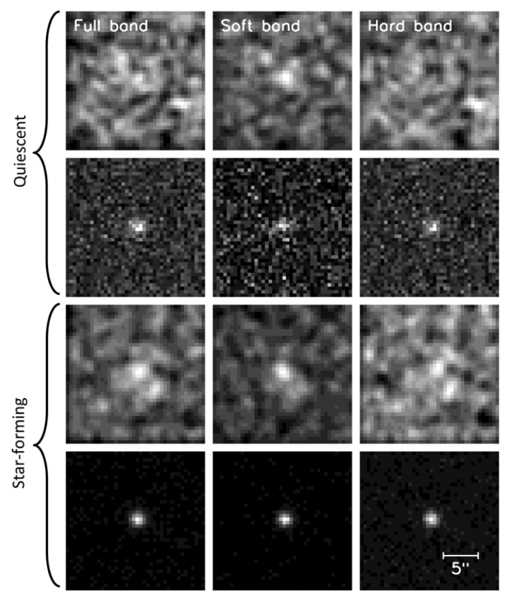
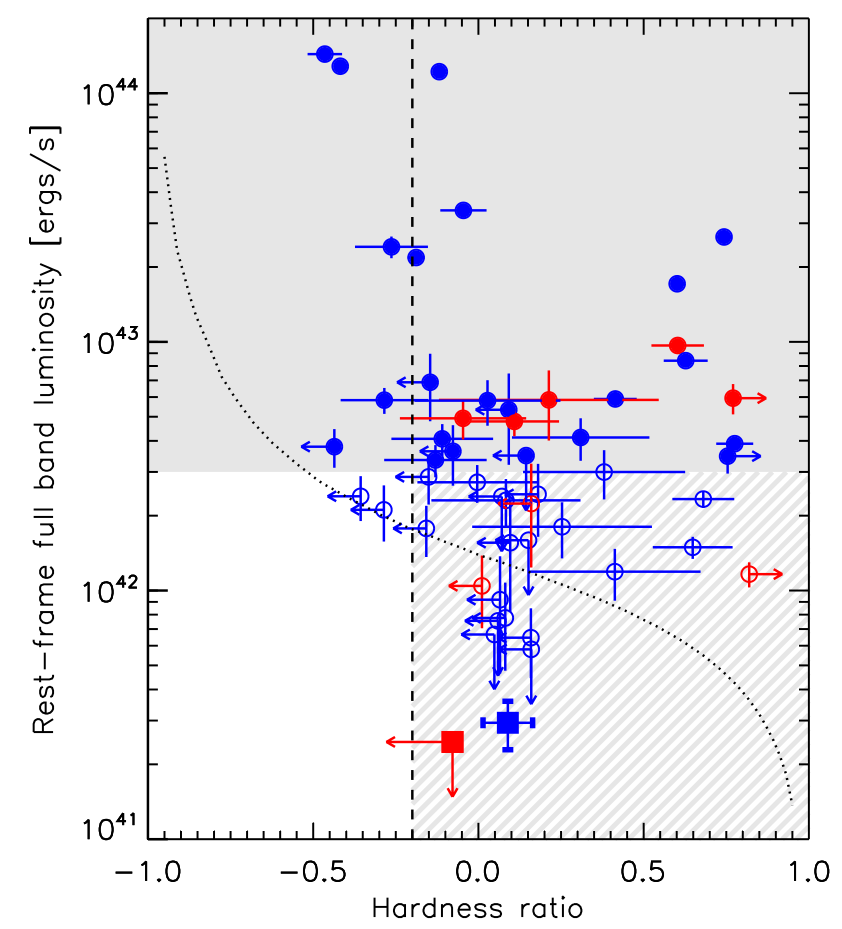
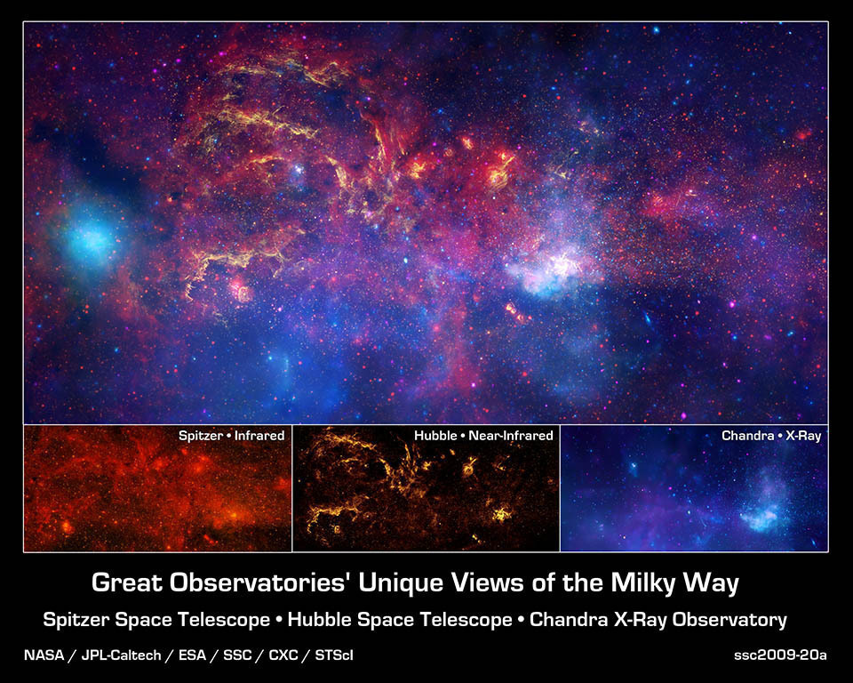

My most recent work in astronomy I carried out as a post-doctoral researcher at the [School of Earth and Space Exploration](https://sese.asu.edu/) (SESE)
at Arizona State University (ASU). 
There I carried out independent research on galaxies far away from our own Milky Way. 
My mentors were [Sangeeta Malhotra](https://asu.pure.elsevier.com/en/persons/sangeeta-malhotra) and [Rogier Windhorst](http://sese-archive.asu.edu/people/rogier-windhorst). 
See the [Contact](http://kpolsen.github.io/Contact/) tab for my contact info in case you have any questions for me.

My main research project at ASU has been SÍGAME - a module designed to model nebular line emission in the 
far-infrared from galaxies and make predictions for future observations. 
Here's an example of a flux map in [CII] fine structure line at 158 micron of a model galaxy:

![Simulated[CII] emission from a model galaxy](sigame1.png)

I started developing SÍGAME during my PhD at the Dark Cosmology Centre, a Center of Excellence in Denmark. 
Over the years, it grew into a mature software tool, rewritten in python and applicable to many cases of 
galaxy studies. 
I have led three first-author publications on SÍGAME and enjoyed working with team members from around the world, 
and the software tool is now available for download via GitHub. 

<a class="radius button small" href="{{ site.url }}/SIGAME_dev/">Learn more about and download SÍGAME here›</a>

At the Dark Cosmology Centre, I also worked on a more observational project which quantified the presence 
of active galactic nuclei (AGN) in massive galaxies at redshifts around 2 (about 10 billion years ago!) 
using [CHANDRA]() archival X-ray data. 
High luminosity AGN are easily detected in X-ray at these redshifts, but to count the low luminosity AGN, 
it is necessary to apply some sort of stacking technique:

As an additional criteria when selecting AGN, the spectral shape of the X-ray emission can be used:

We find in the paper that the low-luminosity AGN population constitutes a significant part of both the 
star-forming and the "quenched" galaxies at redshifts around 2. 
See my 2013 paper below for more details on the technique and results.

<h2 style="color: #006699">Research interests in astronomy</h2>
Keywords: <i>Evolution of galaxies; Epoch of re-ionization; Interstellar Medium, 
Emission lines in radio; Radio interferometry; Galaxy simulations</i>  

My research focuses on the Interstellar Medium (ISM) of galaxies, i.e. that gas out of which stars are formed. 
The amount and properties of the ISM play a crucial role for the evolution of a galaxy, yet for galaxies at 
high redshifts both are poorly determined by observations. 
By observing a portion of ISM in different wavelengths, different images emerge, 
and astronomers can extract important information from each:  

The best technique for observing the ISM is to look for emission lines in the infrared (left bottom panel above), 
where rotational lines of molecules and fine structure lines of atoms and ions are easily excited at 
typical ISM temperatures and densities.   

<h2 style="color: #006699">Publications</h2>

2017: <a href="http://adsabs.harvard.edu/abs/2017ApJ...846..105O">SÍGAME Simulations of the [CII], [OI], and [OIII] Line Emission from Star-forming Galaxies at z ~ 6 (ApJ 846 2, 2017)</a>

2016: <a href="http://adsabs.harvard.edu/cgi-bin/bib_query?arXiv:1507.00012">SImulator of GAlaxy Millimetre/submillimetre Emission (SÍGAME): CO emission from massive z = 2 main-sequence galaxies (MNRAS 457 3, 2016)</a>

2015: <a href="http://adsabs.harvard.edu/cgi-bin/bib_query?arXiv:1507.00362">Simulator of Galaxy Millimeter/Submillimeter Emission (SíGAME): The [CII]-SFR Relationship of Massive z = 2 Main Sequence Galaxies (ApJ 814 1, 2015)</a>

2013: <a href="http://adsabs.harvard.edu/cgi-bin/bib_query?arXiv:1212.1158">Measuring the AGN fraction among star-forming and quiescent galaxies at z~2 (ApJ 764 4, 2013)</a>
