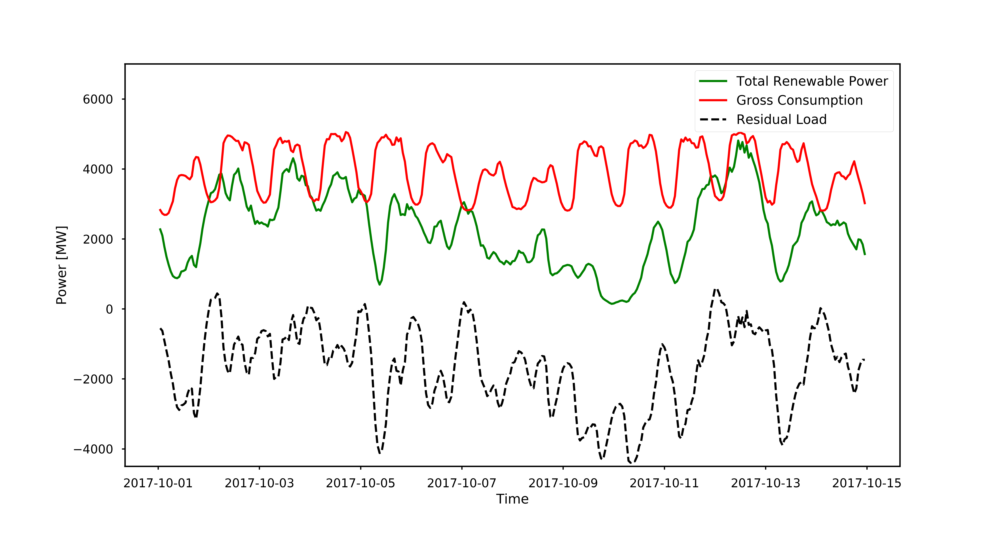
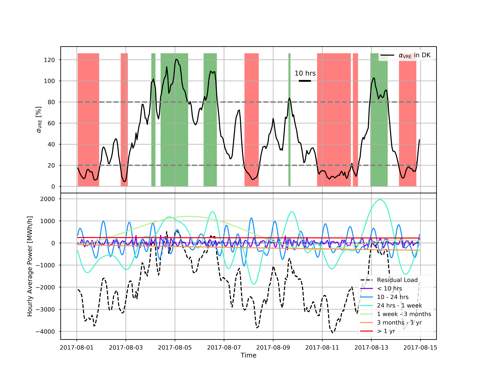
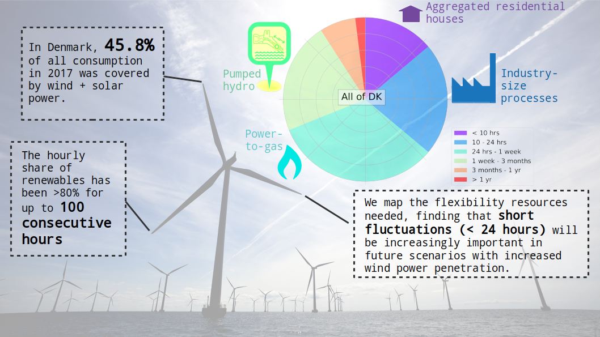

Last edited: Jan 2 2020 

I worked as postdoctoral research at the Center for Electric Power and Energy ([CEE or Elektro](http://www.cee.elektro.dtu.dk/)) at the Danish Technical University (DTU) from July 2018 to January 2020. My research focused on the development and improvement of [integrated energy infrastructures](http://www.cee.elektro.dtu.dk/research/Interconnected-energy-system/Integrated-energy-infrastructures) needed to handle the ever-increasing penetration of renewable energy in power systems. 

<h2 style="color: #006699">The green "mismatch"</h2>

What makes the transition towards green energy so difficult, is the inherent variability of most renewable energy sources, such as wind and solar power. 
There will always be times of mismatch between renewable power production and the gross consumption. 
In power system analysis, we refer to this mismath as the "residual load", and different energy storage (ES) options are being developed 
to either charge or discharge when there is a non-zero residual load. 
The figure below illustrates the concept of residual load with data for Denmark as a whole, extracted [from the data archive of Energinet](https://www.energidataservice.dk/). 
For the two week time span shown, gross consumption (red) follows a clear day/night pattern, and during some hours the renewable power production (green) actually 
exceeds gross consumption, leading to positive residual load (black dashed):

Renewable power production, gross consumption and residual load during a two week time period in October 2017. 
Made with data from https://www.energidataservice.dk.

 

<h2 style="color: #006699">No fossil fuels by 2050 in Denmark</h2>

The Danish government has an overall goal of using 100% renewable energy by 2050 in the energy and transport sectors ([see a short description here](http://denmark.dk/en/green-living/wind-energy)). 
As a step towards reaching that goal, the Danish Parliament agreed in 2012 on a few intermediate targets to be met by 2020 ([see the full agreement here](file:///home/karen/Downloads/EnergyPolicyinDenmark.pdf)): 
- More than 35% renewable energy in final energy consumption
- Approximately 50% of electricity consumption to be supplied by wind power
- 7.6% reduction in gross energy consumption in relation to 2010
- 34% reduction in greenhouse gas emissions in relation to 1990.

We are well on our way, with [wind turbines alone delivering power equivalent to 43.4% of Denmark’s electricity consumption in 2017](https://cleantechnica.com/2018/01/06/44-wind-denmark-smashed-already-huge-wind-energy-records-2017/). 
Since the installation of the first wind turbines in Denmark in the 70's, the total capacity of installed wind turbines has been increasing to almost 6000 MW today:

Increase in total capacity of installed wind turbines, where DK1 and DK2 refers to West and East Denmark respectively, divided at the Little Belt. Made with data from https://ens.dk/.

 

Especially the Western regions of Denmark (DK1) can produce a lot of wind power, due to strong winds reaching Denmark from the Atlantic ocean. 
If all those wind turbines were operating at their maximum capacity at the same time, it would be enough to support roughly 8 million homes, if we adopt a relatively high annual energy consumption of [6000 kWh per year per household](https://www.ovoenergy.com/guides/energy-guides/how-much-electricity-does-a-home-use.html). 
However, all those wind turbines are never producing at their maximum capcity - luckily, because the Danish electricity system would probably not be able to support it! 

<h2 style="color: #006699">The need for flexibility</h2>
Wind is definitely the source of power to go for in Denmark, where solar power is hard to get in winter. 
That said, reaching the goal of 100% renewable energy by 2050 is not just a matter of putting up more wind turbines. 
Wind speeds fluctuate and a whole line of research (and business) is currently dedicated to predict the resulting variability and uncertainty in wind power production. 
Even with prefect predictions of how the wind (and hence the wind power) is going to vary, 
we cannot fully take advantage of the wind power produced if the power system is not designed and planned in a flexible manner. 

I worked in a group at DTU that searches for ways to reshape and store wind power in a multi-energy system by making connections to e.g. the hot water and gas sectors. 
For that work, I was involved in the EPIMES project: [Enhancing wind Power Integration through optimal use of cross-sectoral flexibility in an integrated Multi-Energy System](http://www.dtu.dk/english/news/nyhed?id=1e387552-3d06-4f2c-ab2b-f1b602e8e27a), a project which is a collaboration between DTU CEE and Chinese partners, including Tsinghua University in Beijing. 
On the Danish side, much work has gone into studying the flexibility options in a normal residential house, where energy can be stored as heat and smart planning using Model Predictive Control can ensure that heating takes place mostly at times with low electricity prices ([see a recent paper on this here](http://orbit.dtu.dk/files/139062795/WJET_2017101016173894.pdf)). 

I used different tools to analyze the residual load (see above definition) with the aim of setting requirements for ES options now and in the future. 
A great tool for the analysis of fluctuating data, is Fourier analysis which I have exploited in order to separate fluctuations at different frequencies. 
Below is a slightly stuffed figure exemplifying the methods for two weeks in 2017. 
The top panel shows hourly share of renewables, with time periods of low (<20%) and high (>80%) hourly share highlighted in red and green. 
The bottom panel gives the residual load (black dashed) and the Fourier components that can be extracted by selecting different frequency intervals 
(denoted by their corresponding period in the plot legend). 

Identifying fluctuations in residual power on different time scales. Made with data from https://www.energidataservice.dk.

 

Having separated fluctuations on different time scales, they can be further analyzed to give the relative capacity needed from different types of ES, from residential houses to 
[pumped hydro](http://energystorage.org/energy-storage/technologies/pumped-hydroelectric-storage):

Connecting the fluctuations in residual power to different types of ES - an overview of my research so far.

 

<h2 style="color: #006699">Introducing "windpype": a python module for analyzing residual load</h2>

The code that I write in order to analyze ramps in residual power, I have organized in a python module, 
still very much under development. 
Since the module is essentially a pipeline tool to handle time series of wind power, 
I named it windpype (with 'py' as in python, because misspelling is in):

<a class="radius button small" href="{{ site.url }}/windpype_dev/">Learn more about windpype here›</a>

<h2 style="color: #006699">Publications</h2>

2019: <a href="https://orbit.dtu.dk/en/publications/data-driven-flexibility-requirements-for-current-and-future-scena">Data-driven flexibility requirements for current and future scenarios with high penetration of renewables (Proceedings of International Conference on Applied Energy 2019 [Paper ID: 0341]).</a>

