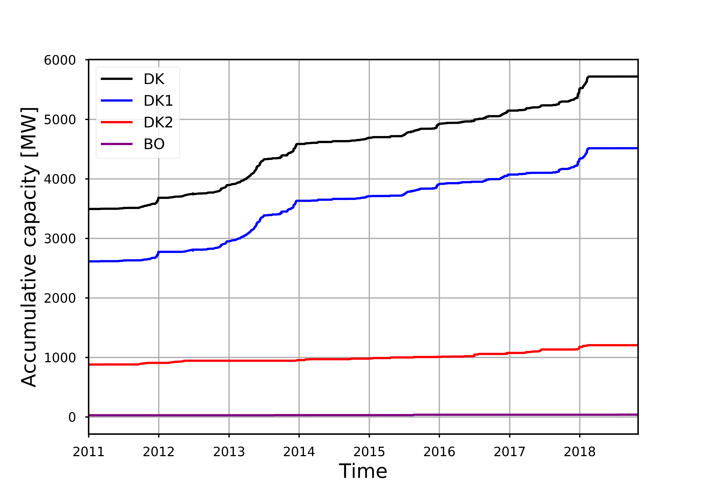

I currently work as postdoctoral research at the Center for Electric Power and Energy ([CEE or Elektro](http://www.cee.elektro.dtu.dk/)) at the Danish Technical University (DTU). My research focuses on the [integrated energy infrastructures](http://www.cee.elektro.dtu.dk/research/Interconnected-energy-system/Integrated-energy-infrastructures) necessary in order to increase the penetration of renewable energy in the Danish electricity supply.

<h2 style="color: #006699">No fossil fuels by 2050 in Denmark</h2>

The Danish government has an overall goal of using 100% renewable energy by 2050 in the energy and transport sectors ([See a short description here](http://denmark.dk/en/green-living/wind-energy)). 
As a step towards reaching that goal, the Danish Parliament agreed in 2012 on a few intermediate targets to be met by 2020 ([see the full agreement here](file:///home/karen/Downloads/EnergyPolicyinDenmark.pdf)): 
- More than 35% renewable energy in final energy consumption
- Approximately 50% of electricity consumption to be supplied by wind power
- 7.6% reduction in gross energy consumption in relation to 2010
- 34% reduction in greenhouse gas emissions in relation to 1990.

We are well on our way, with [wind turbines delivering power equivalent to 43.6% of Denmark’s electricity consumption in 2017](https://cleantechnica.com/2018/01/06/44-wind-denmark-smashed-already-huge-wind-energy-records-2017/). 
Since the installation of the first wind turbines in Denmark in the 70's, the total capacity of installed wind turbines has been increasing to almost 6000 MW:

Increase in total capacity of installed wind turbines, made with data from [https://ens.dk/].

Especially the Western regions of Denmark (DK1) can produce a lot of wind power, due to strong winds reaching Denmark from the Atlantic ocean. 
If all those wind turbines were operating at their maximum capacity at the same time, it would be enough to support roughly 8 million homes, if we adopt a relatively high annual energy consumption of [6000 kWh per year per household](https://www.ovoenergy.com/guides/energy-guides/how-much-electricity-does-a-home-use.html). 
However, all those wind turbines are never producing at their maximum capcity - luckily, because the Danish electricity system probably would not be able to support it! 

<h2 style="color: #006699">The need for flexibility</h2>
Wind is definitely the source of power to go for in Denmark, where solar power is hard to get in winter. 
That said, reaching the goal of 100% renewable energy by 2050 is not just a matter of putting up more wind turbines. 
Wind speeds fluctuate and a whole line of research (and business) is currently dedicated to predict those fluctuations. 
Evern with prefect predictions of how the wind (and hence the wind power) is going to fluctuate, 
we cannot fully take advantage of the wind power produced if the power system is not designed in a flexible, that for example knows when to store or re-directing excess power. 

I work in a group at DTU that searched for ways to reshape and store wind power as gas and heating in Denmark. 
For that work, I am involved in the EPIMES project: [Enhancing wind Power Integration through optimal use of cross-sectoral flexibility in an integrated Multi-Energy System](http://www.dtu.dk/english/news/nyhed?id=1e387552-3d06-4f2c-ab2b-f1b602e8e27a), a project which is a collaboration between DTU CEE and Chinese partners, including Tsinghua University in Beijing. 
On the Danish side, much work has gone into studying the flexibility options in a normal residential house, where energy can be stored as heat and smart planning using Model Predictive Control, can ensure that heating takes place mostly at times with low electricity prices ([see a recent paper on this here](http://orbit.dtu.dk/files/139062795/WJET_2017101016173894.pdf)). 

Identifying dips in wind power production on different time scales, with longer dips indicated with red-shaded areas and shorter dips indicated with blue-shaded areas. Made with data from [https://www.energidataservice.dk/].

